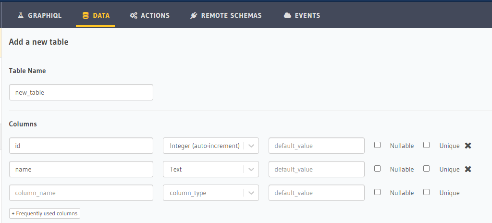
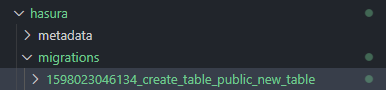
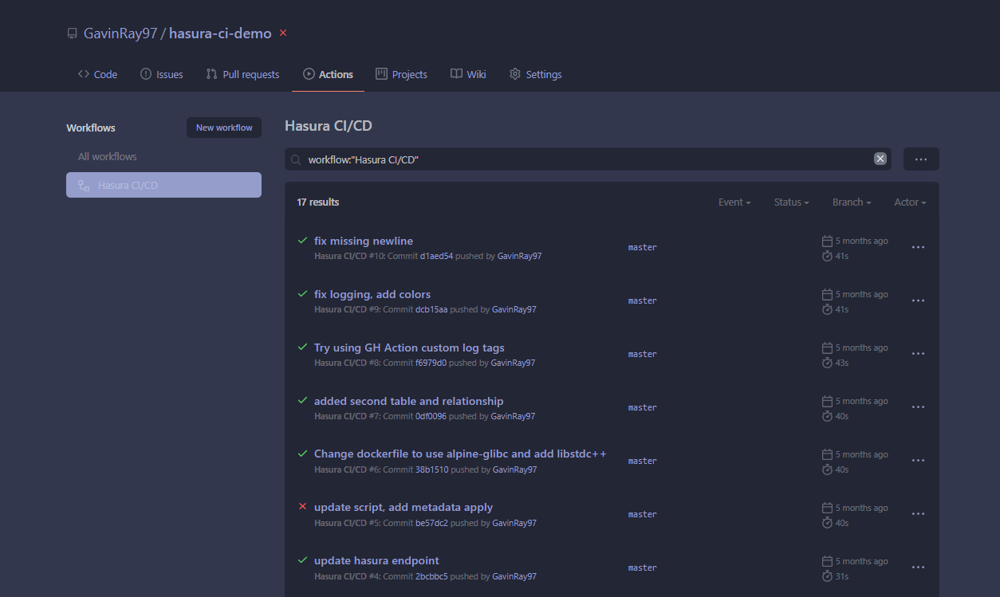
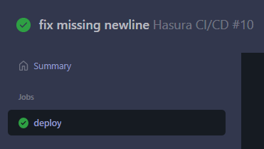

# hasura-ci-demo

- [hasura-ci-demo](#hasura-ci-demo)
  - [Introduction](#introduction)
  - [Requirements](#requirements)
  - [Setup](#setup)
  - [Workflow](#workflow)

## Introduction

This repo demonstrates an example workflow for local Hasura development -> Hasura Cloud

Docker Compose is used to run local Hasura and Postgres containers.
Then, `hasura console` is used to track changes made through the web UI to the database (migrations) or Hasura's metadata/permissions.

Finally, the `hasura-ci-cd-action` Github Action is used on push/merge, which takes the DB migrations and metadata changes and applies them to the Hasura Cloud instance so that it is in sync with the changes made locally.

## Requirements

- Docker Compose
- Hasura Console
- Hasura Cloud account

## Setup

1. Clone this repo
2. Start Hasura and Postgres, with `docker-compose up -d`
3. `cd hasura` and then `hasura console` to start the web UI
4. Visit the `hasura console` served web UI at http://localhost:9695
   - _Note:_ You should see some dummy/test tables (`first_table`, `second_table`, etc). These are tables that were in the `./hasura/migrations` folder, and the Docker Compose is set up to use the Hasura version which automatically applies these migrations on startup.

## Workflow

1. Make changes to the database schema or Hasura metadata/permissions

   - For this example, let's create a table called `new_table` which has `id` that is an `integer (autoincrement)`
     - 
   - After creating this table, behind the scenes, `hasura console` should have created a new migration in your `./hasura/migrations` folder now:
     - 
   - Now we need to get these new changes into our deployed Cloud instance.
     - The Hasura CLI has two commands for this: `hasura migrate apply` and `hasura metadata apply`.
     - These commands take an `--endpoint` and `--admin-secret` flag
     - We could get this new table on our Cloud instance by running: `hasura migrate apply --endpoint https://my-cloud-app-name.hasura.app --admin-secret my-secret` (and then also `hasura metadata apply` using those same flags if we made any metadata/permissions changes)
     - To speed up this common usecase, we've published a Github Action that runs these two commands for you (if you like).
   - Overwrite the `main.yaml` workflow file located in this repo at `.github/workflows/main.yaml` with the following content:

     - ```yaml
        name: Hasura CI/CD

        on:
            push:
                branches:
                  - master

        jobs:
            deploy:
                runs-on: ubuntu-latest
                steps:
                - uses: actions/checkout@v2
                - name: Hasura CI/CD
                    uses:  GavinRay97/hasura-ci-cd-action@v1.3
                    with:
                        PATH_TO_HASURA_PROJECT_ROOT: ./hasura
                        HASURA_CLI_VERSION: v1.3.4-beta.2
                        HASURA_ENDPOINT: https://my-cloud-app-name.hasura.app
                        HASURA_ADMIN_SECRET: ${{ secrets.HASURA_ADMIN_SECRET }}
                        HASURA_MIGRATIONS_ENABLED: true
       ```

   - Replace `my-cloud-app-name` in `HASURA_ENDPOINT` with the name used in your actual Cloud app URL, and either create a Github Secret called `HASURA_ADMIN_SECRET` or put the admin secret in plaintext there (not advised)
   - Do a `git add`, `git commit`, and `git push` to push the new table migration and updated Github Action workflow file to Github
   - After pushing, if you go to the "Actions" tab of your Github repo, you should see the Action there, processing <br> 
   - You can click the name of the commit message in the Action list to open that specific Action job, and then click "Deploy" on the left to get a live log of the Action output (there is debugging and informational logging printed during the Hasura CI/CD action run) <br> 
   - Assuming nothing went catastrophically wrong somehow, this should complete and if you open your Cloud app you should now see the new table there =)
